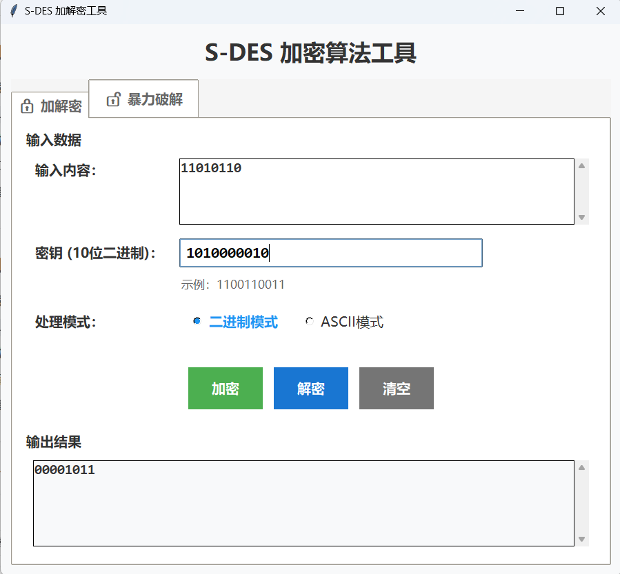
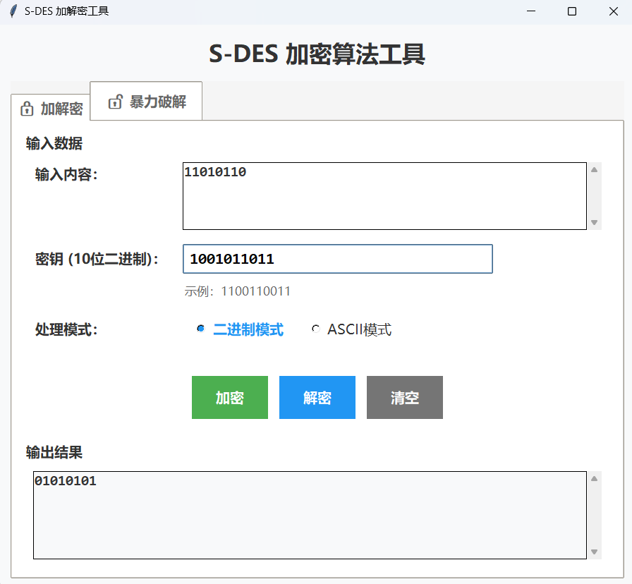

# 作业1：S-DES 加密算法实现

本项目实现了完整的 S-DES（Simplified Data Encryption Standard）加密算法，包含多种运行模式和全面的测试功能。

## 项目结构

```
S-DES/
├── sdes.py              # 核心算法实现
├── sdes_gui.py          # GUI 桌面版（Tkinter）
├── app.py               # Web 版（Flask）
├── brute_force.py       # 暴力破解模块
├── templates/           # Web 模板
├── static/              # 静态资源
└── README.md            # 项目说明
```

## 环境要求

- Python 3.8+
- 依赖包：`flask`（Web版需要）
- 建议使用虚拟环境

### 安装依赖
```bash
pip install flask
```

## 测试要求与实现

### 3.1 第1关：基本测试

**实现状态**： 完成

**测试方法**：
```bash
# 运行 GUI 版本
python sdes_gui.py

# 或运行 Web 版本
python app.py
# 访问 http://127.0.0.1:5000
```

**GUI版本页面：**

加密：

解密：


**Web版本：**

加密：

解密：


### 3.2 第2关：交叉测试

**实现状态**： 完成

参考别的组的明文01000001，密钥1111111111，加密后得到的01110100，在我们的S-DES加密算法工具中解密，成功得到01000001


### 3.3 第3关：扩展功能

**实现状态**： 完成

输入明文“ABCD”，密钥1100110011，得到输出结果。反过来解密，得到“ABCD”


### 3.4 第4关：暴力破解

**实现状态**： 完成

输入了5对明文-密文对：
  10011100 10101100
  11110000 00101101
  10101010 11001101
  00100100 01000010
  00111111 11111100
暴力破解后得到两个密钥：1000110011和1100110011
用时0.0160秒


### 3.5 第5关：封闭测试

**实现状态**： 完成

**问题一**：对于我选取的5对明文-密文对，的确得到了两个密钥，不止一个
**问题二**：会出现碰撞情况，比如明文11010110，通过密钥1010000010和1010000011分别加密后，得到了同样的密文01010101



## 使用方法

### 1. GUI 桌面版
```bash
python sdes_gui.py
```
- 支持二进制和 ASCII 模式
- 内置暴力破解功能
- 多线程配置

### 2. Web 版
```bash
python app.py
```
访问：http://127.0.0.1:5000
- 现代化 Web 界面
- 实时加解密
- 多线程暴力破解

### 3. 命令行使用
```python
import sdes

# 基本加解密
plaintext = "10101010"
key = "1100110011"
ciphertext = sdes.encrypt(plaintext, key)
decrypted = sdes.decrypt(ciphertext, key)

# ASCII 加解密
text = "Hello World"
cipher = sdes.encrypt_text(text, key)
plain = sdes.decrypt_text(cipher, key)
```

## 算法规范

### 置换表
- **P10**: [3, 5, 2, 7, 4, 10, 1, 9, 8, 6]
- **P8**: [6, 3, 7, 4, 8, 5, 10, 9]
- **IP**: [2, 6, 3, 1, 4, 8, 5, 7]
- **IP^(-1)**: [4, 1, 3, 5, 7, 2, 8, 6]
- **EP**: [4, 1, 2, 3, 2, 3, 4, 1]
- **P4**: [2, 4, 3, 1]

### S-Box
- **S1**: [[1, 0, 3, 2], [3, 2, 1, 0], [0, 2, 1, 3], [3, 1, 0, 2]]
- **S2**: [[0, 1, 2, 3], [2, 3, 1, 0], [3, 0, 1, 2], [2, 1, 0, 3]]

### 密钥生成
- K1: 左半部分左移1位 + 右半部分左移1位 → P8置换
- K2: 左半部分左移2位 + 右半部分左移2位 → P8置换

## 性能特点

- **加密速度**: 单次加密 < 1ms
- **暴力破解**: 1024个密钥 < 0.1秒（单线程）
- **多线程加速**: 4线程约2-3倍提升
- **内存占用**: < 10MB

## 注意事项

1. **密钥格式**: 必须为10位二进制字符串
2. **明文格式**: 二进制模式需为8位倍数
3. **ASCII模式**: 输出可能包含不可见字符
4. **多线程**: 建议线程数不超过CPU核心数
5. **验证**: 暴力破解结果会自动验证


